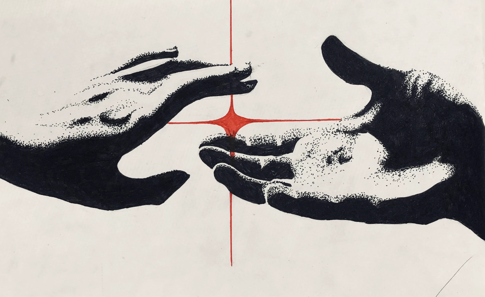
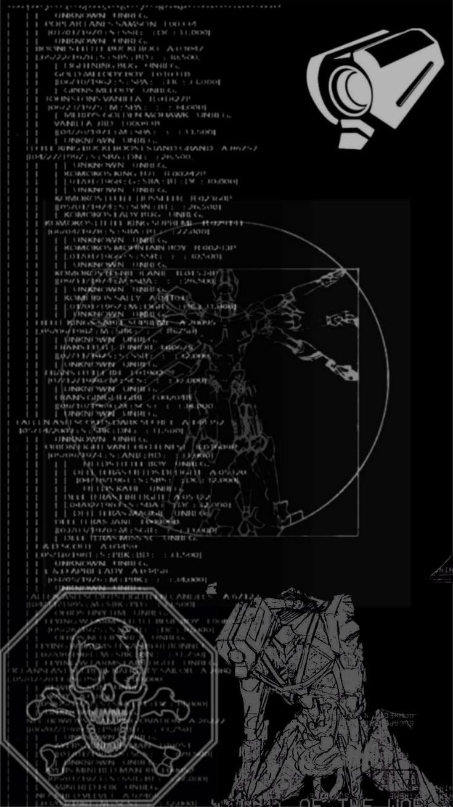
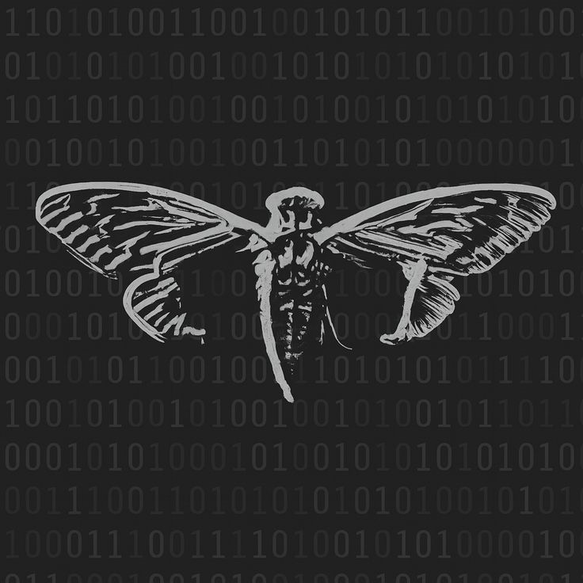

<!-- ========================================== -->
<!-- README #1: DESIGN & CODE (NOIR / DARK MONOCHROME) -->
<!-- ========================================== -->

  <!-- ВЕРХНИЙ БАННЕР -->
  

 

<!-- РЯД ЗНАЧКОВ / БЕЙДЖЕЙ -->

  
  
  

 

<!-- БЛОК 1: ТЕКСТ СЛЕВА + ГРАФИКА СПРАВА -->
<table border="0" width="100%">
  <tr>
    <td width="40%" valign="top" align="center">
      
    </td>
    <td width="60%" valign="middle" style="padding-left: 15px;">
      <h3>✨ Design & Engineering</h3>
      

        Привет! Я <b>дизайнер и разработчик</b>. Обожаю создавать не просто красивую визуалку, а <b>красивые и главное работающие штуки</b> — от продуманных UI/UX интерфейсов и графики до кастомных десктопных приложений на Python.
      

      

        В своём Telegram-канале <b>«вбросы»</b> я делюсь процессами разработки, концептами, фишками Figma и кодом, который превращает макеты в живые сервисы.
      

    </td>
  </tr>
</table>

 

<!-- БЛОК 2: ТЕКСТ И АРТ С МОТЫЛЬКОМ -->
<table border="0" width="100%">
  <tr>
    <td width="60%" valign="middle" style="padding-right: 15px;">
      <h3>🕷️ Стек и фишки</h3>
      

        Люблю эстетику нуара, кастомизацию систем, продуманную типографику и аккуратный код. Работаю на стыке графики и софта.
      

      

        <code>Figma</code> • <code>Photoshop</code> • <code>Python (PyQt / CustomTkinter)</code> • <code>HTML/CSS/JS</code>
      

    </td>
    <td width="40%" valign="top" align="center">
      
    </td>
  </tr>
</table>

 

<!-- ГРАФИК АКТИВНОСТИ ВНИЗУ -->

  <h3>📊 Activity Graph</h3>
  

