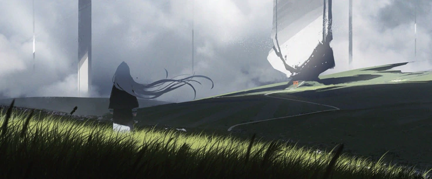
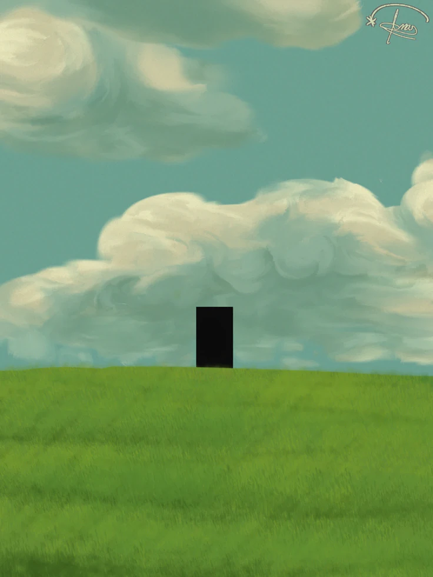

<!-- ========================================== -->
<!-- README #2: REZE (DARK FOREST GREEN / PERSONAL LAB) -->
<!-- ========================================== -->

  <!-- ВЕРХНИЙ БАННЕР -->
  

 

<!-- РЯД ЗНАЧКОВ / КНОПОК -->

  
  
  

 

<!-- БЛОК 1: ОПИСАНИЕ И АНИМЕ/ПЕЙЗАЖНЫЙ АРТ -->
<table border="0" width="100%">
  <tr>
    <td width="35%" valign="top" align="center">
      
    </td>
    <td width="65%" valign="middle" style="padding-left: 15px;">
      <h3>🌿 Всем привет!</h3>
      

        Рад видеть вас в моём профиле! 👋
      

      

        Тут я скидываю свои <b>личные работы</b>, которые делал не для какого-то конкретного коммерческого проекта, а просто <b>для души и своего удобства</b>.
      

      

        Если хотите — можете посмотреть исходники, заценить интерфейсы или даже попробовать пару моих созданных программ и утилит.
      

    </td>
  </tr>
</table>

 

<!-- БЛОК 2: ПРИЛОЖЕНИЯ И ВТОРОЙ АРТ -->
<table border="0" width="100%">
  <tr>
    <td width="65%" valign="middle" style="padding-right: 15px;">
      <h3>🧪 Личная лаборатория</h3>
      

        Здесь собраны скрипты, тулзы для кастомизации, эксперименты с интерфейсами и уютные пет-проекты.
      

      

        Заглядывайте в репозитории — буду рад обратной связи, звёздочкам ⭐ и фидбеку!
      

    </td>
    <td width="35%" valign="top" align="center">
      
    </td>
  </tr>
</table>

 

<!-- ГРАФИК АКТИВНОСТИ ВНИЗУ (ТЁМНО-ЗЕЛЁНАЯ ТЕМА) -->

  <h3>📉 Contributions</h3>
  

